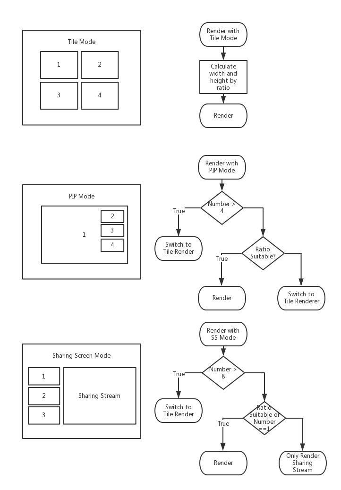

# Auto layout for video call 
- provide a solution for layout of web video call app (Support mobile devices) when using Agora WebRtc SDK.

## What's done?
First we define three kinds of layout: tile mode, pip mode, and screen sharing mode. 

- Tile mode is a base solution for all kinds of circumstances, we calculate a suitable size depending on size of ontainer and max/min ratio, and then update video item's style.
- PIP mode is for 1-4 streams in channel, if there are more streams or ratio is not suitable, it will automatically switch to Tile mode.
- Sharing Screen mode is for 1-7 normal streams and one 'sharing' stream. Whenever ratio is not suitable, it will only render sharing stream in fit mode (Leave black area but no clipping). 

See example below:

## Example
 

## How to use
You can find source code under /src/render

```javascript
// import 
import Renderer from 'path/to/render' 
// init 
Renderer.init(domId, minRatio, maxRatio)
// do render when you need
Renderer.customRender(streamList, mode, mainId)
// recommend to make container full screen when in mobile size
Renderer.enterFullScreen()
```